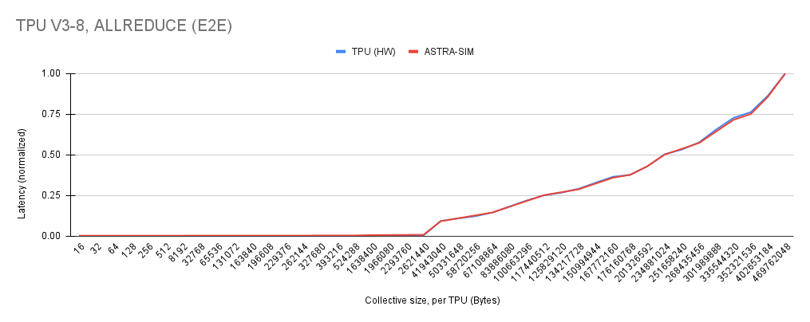
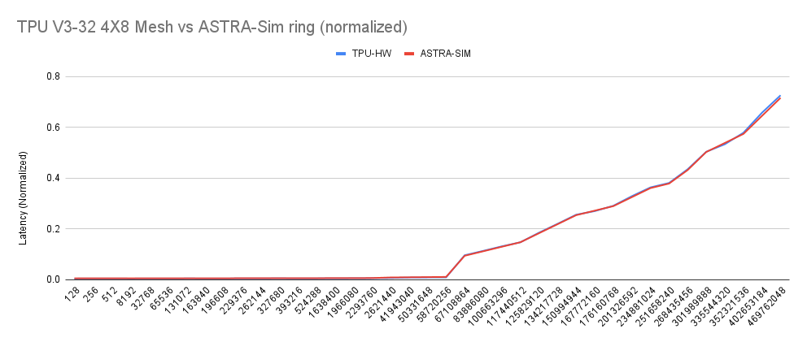
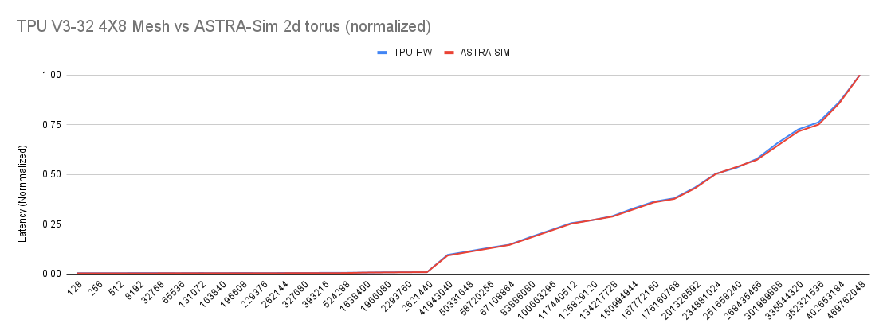

# Validation on Google's TPU-v3


## Senario - 1: v3-8 nodes
### Hardware Setup
1. 8 TPUs connected in a bidirectional ring
2. Each of the 2 links are 80 GB/s
3. Jax All-reduce is based on NCCL ring Algorithm

### ASTRA-Sim setup
1. Modelled with the ASTRA-Sim Analytical Backend
2. Bidirectional Ring
3. Link Latency is 1 us [as per TPU research team]

### Collectives run
1. All-Reduce & All-gather
2. Reduction operation - Sum


### Results
All Reduce results:



All Gather results:


## Senario - 1: v3-32 nodes
### Hardware Setup
1. 32 TPUs connected in a Mesh
2. Each of the 2 (or 3) links are 80 GB/s
3. Jax All-reduce is based on NCCL ring Algorithm

### ASTRA-Sim setup
1. Modelled with the ASTRA-Sim Analytical Backend
2. Bidirectional Ring and 2D Torus
3. Link Latency is 1 us [as per TPU research team]

### Collectives run
1. All-Reduce
2. Reduction operation - Sum


### Results
TPU v3-32 modelled as a Ring:



TPU v3-32 modelled as a 2D-Torus:



## Recommended practices
1. Factor in SW overheads such as JIT's lazy compilation and dispatch time, by calling and tracking the allreduce over differrent iterations.
2. factor in pmap release to ensure the code is optimized
3. Sample code for running allreduce on Jax:

```python 
import jax
import jax.numpy as jnp
from jax import pmap
import time


size_of_allreduce_in_bytes = [128]


iterations = [10000]

for iterr in iterations:
    for ss in size_of_allreduce_in_bytes:

        num_devices = jax.local_device_count()

        x = jnp.arange(ss/(4*num_devices))
        x1 = [x,x,x,x,x,x,x,x] # for 8 TPUs
        x2 = jnp.array(x1)

        print(f"running collective of size = {x2.nbytes}")

        pmapped_fn = jax.pmap(lambda xx: jax.lax.psum(xx, 'i'), axis_name='i')

        start_time = time.time()
        for i in range(iterr):
            r = pmapped_fn(x2)
        end_time = time.time()

        print(f"num_iter = {iterr}")
        print(f"execution_time = {(end_time-start_time)/iterr}")
```

